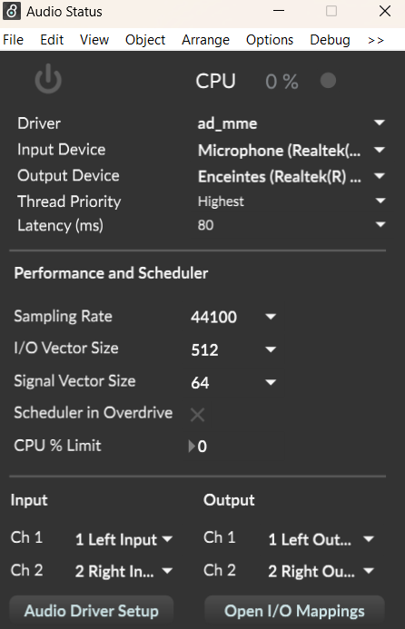
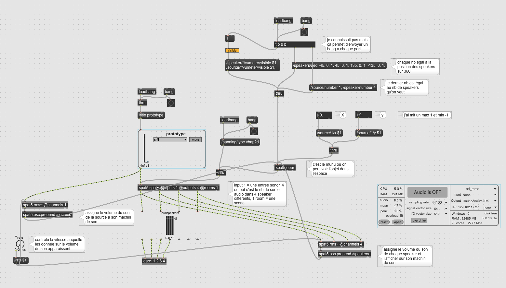

# Prototype spat

## Logiciel et nécessaire
- Max 8
- Package de [spat](https://forum.ircam.fr/projects/detail/spat/)

## Utilité
 Le package de spat permet de contrôler le volume du son dans les haut-parleurs a partir de la position du x et des y dans un espace. Mon prototype dans le futur va se fusionner avec [le prototype de Jacob](https://github.com/Les-gars-d-la-table/prototype) pour que la position des objets sur la table soit détectée et que les sons qu'ils génèrent aient un volume différent dans chacun des speakers.

 ## Fonctionnement

### Haut-parleurs 📢
On peut placer des haut-parleurs dans un espace virtuel qui vont revoir les sons d'une source x. Le plus proche la source est d'un haut-parleur, le plus fort le volume d'un son va augmenter.
### Sources 🟢
On peut placer une source dans l'espace virtuel qui va générer un son/musique. On peut contrôler la position du x et des y pour rapprocher la source des haut-parleurs ou l'éloigner.
//
## Matériel
- 4 speakers
- une carte de son externe
- un ordinatoeur
Les 4 speakers seraient connectés à la carte de son externe qui serait connectée à l'ordinateur.
## settings

Il faut s'assurer de connecter le bon output device et de vérifier que le output mapping est bien configurée pour le projet.

## Max 

