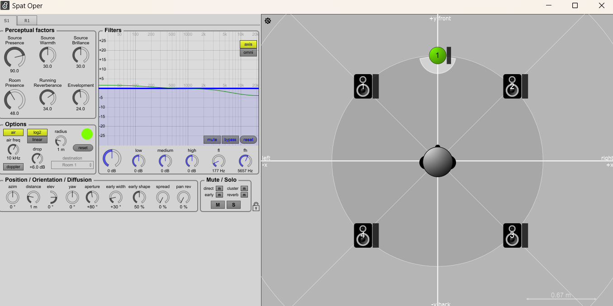

# Prototype spat

## Logiciel et nécessaire
- Max 8
- Package de [spat](https://forum.ircam.fr/projects/detail/spat/)

## Utilité
 Le package de spat permet de controler le volume du son dans les speakers a partire de la position du x et des y dans un espace. Mon prototype dans le future va se fusionner avec [le prototype de Jacob](https://github.com/Les-gars-d-la-table/prototype) pour que la position des objets sur la table soit détectée et que les sons qu'ils génèrent aient un volume différent dans chacun des speakers.

 ## Fonctionnement

### speakers 
On peut placer des speakers dans un espace virtuel qui vont revoir les sons d'une source x. Le plus proche la source est d'un speaker, le plus fort le volume d'un son va augmenter.
### sources
On peut placer une source dans l'espace virtuel qui va générer un son/musique. On peut controler la position du x et des y pour raprocher la source des speakers ou l'éloigné.

